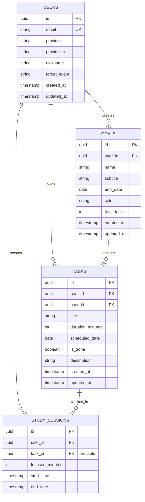

# FlowPlan DB 스키마 (ERD) 설계서

본 문서는 FlowPlan 서비스의 데이터베이스 스키마 및 테이블 간의 관계(ERD)를 정의합니다. (MySQL 기준)

## 1. ERD (Entity Relationship Diagram)

## 2. 테이블 상세 명세

### 2.1 USERS (사용자)
사용자의 소셜 로그인 정보 및 프로필 설정을 관리합니다.

| 컬럼명 | 데이터 타입 | 제약조건 | 설명 |
| :--- | :--- | :--- | :--- |
| `id` | VARCHAR(36) | PK | 사용자 고유 식별자 (UUID) |
| `email` | VARCHAR(255) | UNIQUE | 이메일 주소 |
| `provider` | VARCHAR(50) | NOT NULL | 소셜 로그인 제공자 (google, kakao 등) |
| `provider_id` | VARCHAR(255) | NOT NULL | 소셜 제공자 측 고유 ID |
| `nickname` | VARCHAR(50) | NOT NULL | 사용자 닉네임 (기본값 지원) |
| `target_exam` | VARCHAR(100) | NOT NULL | 목표 시험 (수능, 공무원, 자격증 등) |
| `created_at` | TIMESTAMP | DEFAULT CURRENT_TIMESTAMP | 계정 생성 일시 |
| `updated_at` | TIMESTAMP | DEFAULT CURRENT_TIMESTAMP | 정보 수정 일시 |

### 2.2 GOALS (목표)
사용자가 등록한 굵직한 학습 목표(예: 수능 수학1 개념 완성)를 관리합니다.

| 컬럼명 | 데이터 타입 | 제약조건 | 설명 |
| :--- | :--- | :--- | :--- |
| `id` | VARCHAR(36) | PK | 목표 고유 식별자 (UUID) |
| `user_id` | VARCHAR(36) | FK, NOT NULL | 소유자(User) ID |
| `name` | VARCHAR(255) | NOT NULL | 목표명 |
| `subtitle` | VARCHAR(255) | | 목표 설명 또는 범위 |
| `end_date` | DATE | NOT NULL | 목표 완료 예정일 |
| `color` | VARCHAR(20) | DEFAULT '#000000'| UI에 표시될 과목/목표 색상 |
| `total_tasks` | INTEGER | DEFAULT 0 | 전체 분할된 Task 개수 |
| `created_at` | TIMESTAMP | DEFAULT CURRENT_TIMESTAMP | 생성 일시 |
| `updated_at` | TIMESTAMP | DEFAULT CURRENT_TIMESTAMP | 수정 일시 |

### 2.3 TASKS (할 일/일정)
AI가 목표를 분할하여 만들어낸 개별 학습 단위(일정)를 관리합니다.

| 컬럼명 | 데이터 타입 | 제약조건 | 설명 |
| :--- | :--- | :--- | :--- |
| `id` | VARCHAR(36) | PK | Task 고유 식별자 (UUID) |
| `goal_id` | VARCHAR(36) | FK, NOT NULL | 연결된 목표(Goal) ID |
| `user_id` | VARCHAR(36) | FK, NOT NULL | 조회 최적화를 위한 사용자 ID |
| `title` | VARCHAR(255) | NOT NULL | 학습 항목명 (예: 1단원 지수와 로그) |
| `duration_minutes`| INTEGER | DEFAULT 0 | 예상 학습 소요 시간 (분) |
| `scheduled_date` | DATE | NOT NULL | 학습이 배정된 날짜 |
| `is_done` | BOOLEAN | DEFAULT FALSE | 완료 여부 체크박스 상태 |
| `description` | TEXT | | 상세 학습 안내문 |
| `created_at` | TIMESTAMP | DEFAULT CURRENT_TIMESTAMP | 생성 일시 |
| `updated_at` | TIMESTAMP | DEFAULT CURRENT_TIMESTAMP | 수정 일시 |

### 2.4 STUDY_SESSIONS (학습 세션 / 통계용)
타이머를 통해 측정된 실제 학습(집중) 시간을 기록하여 주간/월간 통계 차트에 활용합니다.

| 컬럼명 | 데이터 타입 | 제약조건 | 설명 |
| :--- | :--- | :--- | :--- |
| `id` | VARCHAR(36) | PK | 세션 고유 식별자 (UUID) |
| `user_id` | VARCHAR(36) | FK, NOT NULL | 사용자 ID |
| `task_id` | VARCHAR(36) | FK | 어떤 Task를 하며 집중했는지 (NULL 허용) |
| `focused_minutes` | INTEGER | NOT NULL | 실제 집중해서 공부한 시간 (분) |
| `start_time` | TIMESTAMP | NOT NULL | 타이머 시작 시간 |
| `end_time` | TIMESTAMP | NOT NULL | 타이머 종료 시간 |
